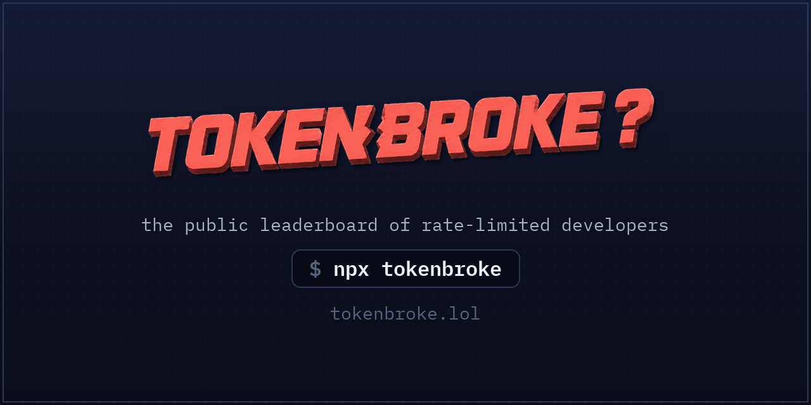

<p align="center">
  
</p>

# tokenbroke

[](https://www.npmjs.com/package/tokenbroke)
[](https://www.npmjs.com/package/tokenbroke)
[](LICENSE)

**A community leaderboard of the most rate-limited AI coding tool users alive.** One command reads your
real local Codex CLI / Claude Code usage and ranks you against everyone else who is also out of tokens.

```bash
npx tokenbroke
```

Five seconds. No signup. Your row, your rank, a roast, and the state of the nation.

## What is this

You opened your terminal with a plan. You had an agent, a branch, and eleven percent of your weekly
usage. Now you have a branch.

tokenbroke is where that goes. Run the command and it reads the usage state your coding tools already
keep on your machine, submits it under a name like `starving-crab-42`, and prints the board. Zero
percent remaining with four days until reset is the top of the leaderboard. Congratulations are not
extended.

Everything on the board is real. There is no form, no screenshot upload, no "enter your numbers." The
only way onto the board is the CLI reading the actual files. You can be slightly fake; the aggregate
cannot.

Underneath the bit, it is a status page for a thing nobody publishes a status page for: how rate-limited
the people using Codex and Claude Code are right now, how fast the tokens are draining, and how many
days it has been since either lab last reset everyone. When the collective misery crosses the Poverty
Line, the site says so out loud. When a reset lands, it counts the offerings and resets the sign to zero.

Are you tokenbroke? Prove it.

## How it works

1. `npx tokenbroke` detects which tools are installed and reads their local usage / rate-limit state
   (Claude Code session logs under `~/.claude`; Codex CLI's locally cached limits).
2. It submits that snapshot, signed, under an anonymous name. Re-running updates your row.
3. It prints a screenshot-worthy leaderboard and a claim URL. Claim with GitHub if you want your face on
   it. You don't have to.

The CLI reads only usage and rate-limit data. It never reads or uploads prompts, code, or conversation
content, and it only submits when you run it.

## Audit it

The paranoia is the point — this command reads files that live next to your credentials, so don't
trust the author, read the code:

- Every filesystem access in the CLI goes through one allowlist-enforcing layer:
  [`packages/cli/src/readers/access.ts`](packages/cli/src/readers/access.ts). Paths not on the
  allowlist cannot be opened; symlinks and hardlinks are rejected before reading.
- Credential files (`~/.codex/auth.json`, `~/.claude/.credentials.json`), prompt history, memories,
  and conversation logs are never opened. Where a mixed file must be read (`~/.claude.json`), only
  allowlisted usage fields are extracted and the rest is discarded.
- The published package is a single bundled file with **zero runtime dependencies** — run
  `npm pack tokenbroke` and read the exact tarball `npx` would execute.
- Update hooks are opt-in: the CLI asks before installing them, and uninstalling is deleting two
  lines from your tool's config.

Licensed [MIT](LICENSE). Security reports: [SECURITY.md](SECURITY.md). Contributions:
[CONTRIBUTING.md](CONTRIBUTING.md).

## Repo

```
apps/web/          tokenbroke.lol (Next.js App Router, Vercel)
packages/cli/      the `tokenbroke` npm package
packages/shared/   brand constants and types shared by the CLI and the site
```

```bash
bun install
bun run dev          # site
bun run build        # everything
bun run lint         # biome
bun run test         # vitest
bun run typecheck
```

Contributors and coding agents: read `AGENTS.md` (product memory + working rules)
before touching anything.

## Stance

tokenbroke is an unaffiliated parody and community tool. It is not endorsed by, associated with, or
speaking for OpenAI or Anthropic. The bit is affectionate. The data is serious.
